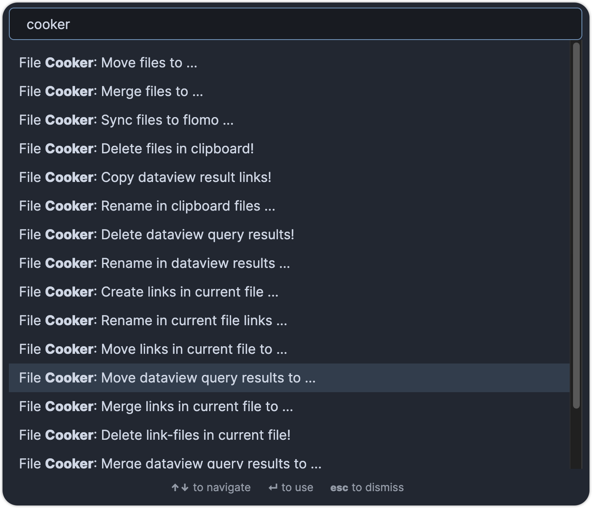

> 欢迎加微讨论：SuppleThinking

# obsidian-file-cooker

This plugin for Obsidian deals batch notes from search results、current file、Dataview query string...
    
## Features

- Move/Copy Multi-File to target folder
- Rename Multi-File
- Add or Change Multi-File's Props
- Delete Multi-File
- Copy Dataview result links to clipboard

> - files from clipboard
> - file links in current file
> - files from dataview query

## Usage

### Move/Copy Multi-Files
#### Move/Copy search results to target folder
`from v1.0.0`
- Query files from Search Plugin
- Copy Search Result
- Run Command 「Move files to ...」
- Select target folder
- Confirm
- Toggle to move or copy
- Confirm

#### Move/Copy all links in current file to target folder
`from v1.1.0`
- Run Command 「Move links in current file to ...」
- Select target folder
- Confirm
- Toggle to move or copy
- Confirm

#### Move/Copy dataview results to target folder
`from v1.3.0`
- select dataview query string
- Run Command 「Move dataview query results to ...」
- Select target folder
- Confirm
- Toggle to move or copy
- Confirm

### Rename Multi-Files
`from v1.5.0`
#### Rename search results
- Query files from Search Plugin
- Copy Search Result
- Run Command 「Rename in clipboard files ...」
- Fill prefix and suffix（start with '-' means delete）
- Confirm

#### Rename all links in current file
- Run Command 「Rename in current file links ...」
- Fill prefix and suffix（start with '-' means delete）
- Confirm

#### Rename dataview results
- select dataview query string
- Run Command 「Rename in dataview results ...」
- Fill prefix and suffix（start with '-' means delete）
- Confirm

### Edit Multi-File's Props

> Need to install MetaEdit first!

`from v1.4.0`
#### Files from clipboard
- Query files from Search Plugin
- Copy Search Result
- Run Command 「Edit Front Matter in clipboard files ...」
- Write Key and Value
- Confirm

#### File links in current file
- Run Command 「Edit Front Matter in current file links ...」
- Write Key and Value
- Confirm

#### Files from dataview query
- select dataview query string
- Run Command 「Edit Front Matter in dataview results ...」
- Write Key and Value
- Confirm

### Delete Multi-Files
#### Delete search results
`from v1.2.0`
- Query files from Search Plugin
- Copy Search Result
- Run Command 「Delete files in clipboard ...」
- Confirm

#### Delete all links in current file
`from v1.2.0`
- Run Command 「Delete link-files in current file ...」
- Confirm

#### Delete dataview results
`from v1.3.0`
- select dataview query string
- Run Command 「Delete dataview query results!」
- Confirm

## How to install

### From within Obsidian
You can activate this plugin within Obsidian by doing the following:
- Open Settings > Third-party plugin
- Make sure Safe mode is off
- Click Browse community plugins
- Search for "File Cooker"
- Click Install
- Once installed, close the community plugins window and activate the newly installed plugin

### Manual installation

- Download the [latest release](https://github.com/ivaneye/obsidian-files-cooker/releases/latest)
- Extract the obsidian-file-cooker folder from the zip to your vault's plugins folder: `<vault>/.obsidian/plugins/`  
Note: On some machines the `.obsidian` folder may be hidden. On MacOS you should be able to press `Command+Shift+Dot` to show the folder in Finder.
- Reload Obsidian
- If prompted about Safe Mode, you can disable safe mode and enable the plugin.